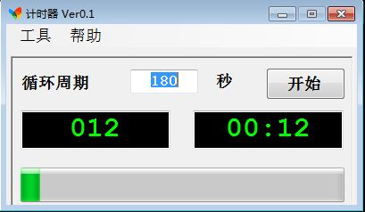

# WTime

## 功能

默认180秒的定时器，也可修改时长。

## 背景

多年前集成MediaGuard CAS时，该公司提供几段测试码流，要求STB接受其码流时某分某秒

* 收到特定消息
* UI显示特定画面

为方便把码流播放位置和STB UI、日志等显式地对应起来，做了该定时器。

## 运行

```
WTime\bin\Release\WTime.exe
```

## 截图


